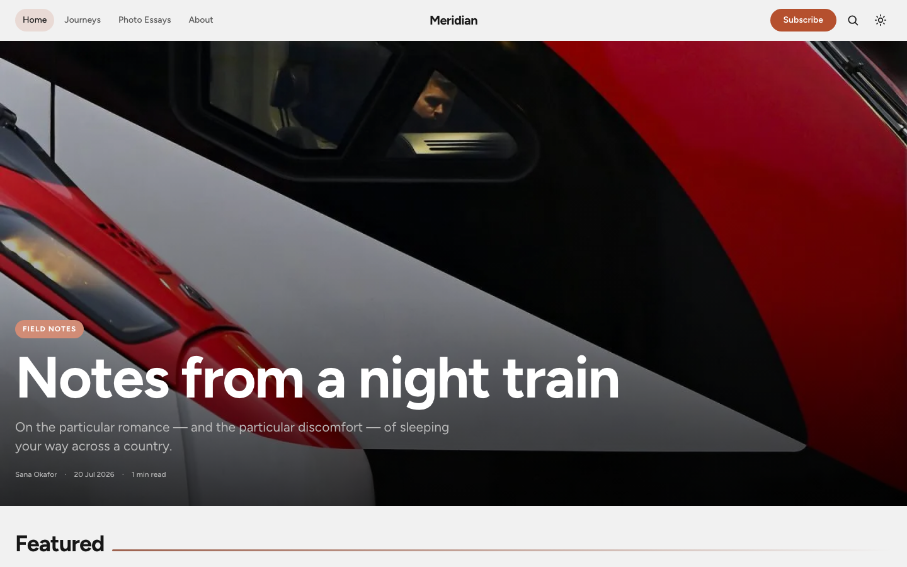
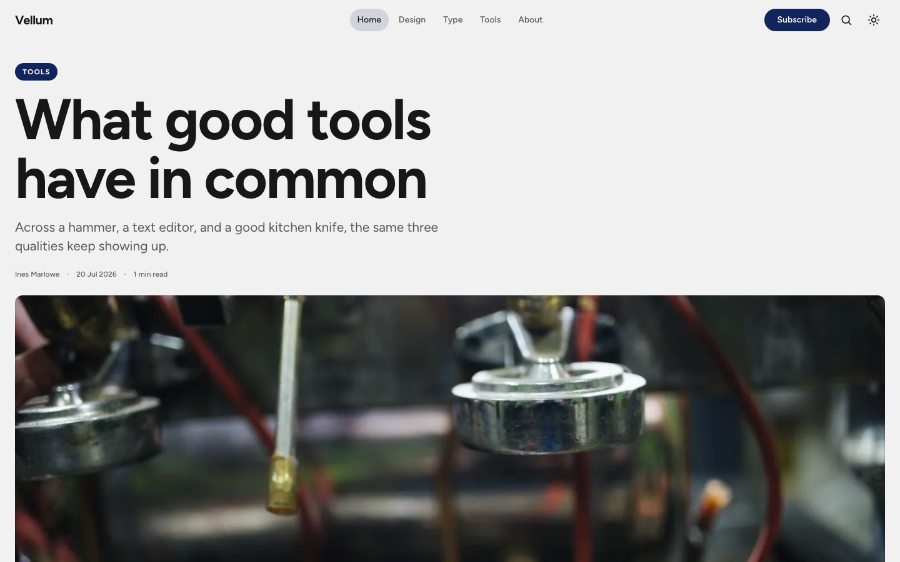
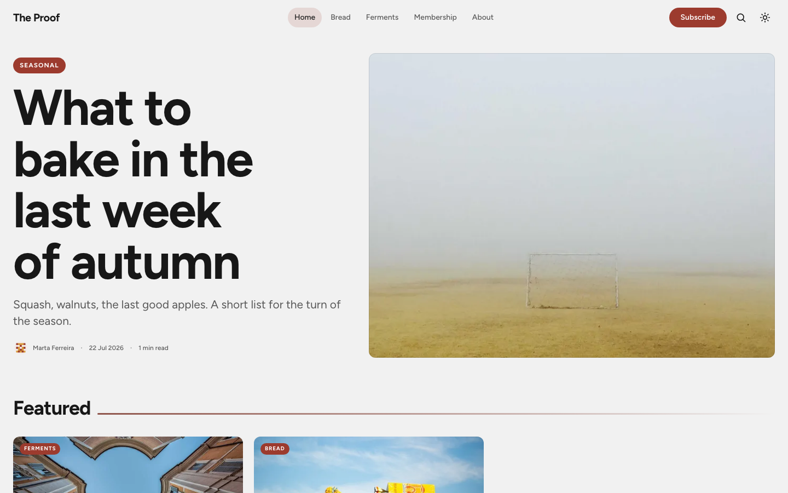
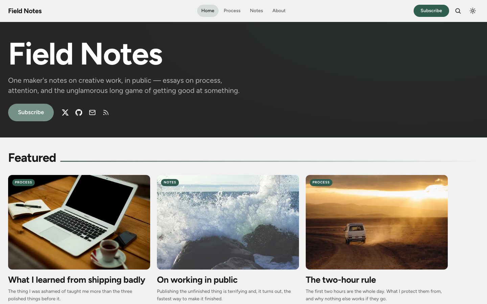

# Astrix

A bold, expressive personal blog theme for **Ghost ≥ 6.0**, built on the
[Astryx design system](https://www.npmjs.com/package/@astryxdesign/core) design tokens.

Astryx components are React-only, so the theme consumes Astryx as a
**tokens-only foundation**: the 184 design tokens (colors, spacing, radius,
elevation, motion, semantic typography) are extracted from
`@astryxdesign/core` at build time and every theme component is hand-written
CSS on top of that vocabulary. All color tokens use `light-dark()`, which is
what makes the dark mode implementation a one-liner.

One theme, many voices. The same components dress up as a travel journal, a
design magazine, a food publication, or a personal blog — just by changing the
hero style, feed layout, and accent in Ghost Admin.

|  |  |
|---|---|
| [**Meridian**](https://adrianoamalfi.github.io/astrix-ghost/#meridian) — travel & photography · *Poster hero, Mosaic feed* | [**Vellum**](https://adrianoamalfi.github.io/astrix-ghost/#vellum) — design & type · *Editorial hero, Bold grid* |
|  |  |
| [**The Proof**](https://adrianoamalfi.github.io/astrix-ghost/#the-proof) — food & membership · *Split hero, List feed* | [**Field Notes**](https://adrianoamalfi.github.io/astrix-ghost/#field-notes) — personal blog · *Personal hero* |
|  |  |

> **[Browse the full showcase & documentation →](https://adrianoamalfi.github.io/astrix-ghost/)**
> Every hero style, feed layout, dark mode, the reading experience, membership, and mobile — with screenshots.

Prefer to click around instead? Run all four demos locally in one command:

```bash
cd demo && docker compose up -d meridian vellum proof fieldnotes
# → localhost:8081 · 8082 · 8083 · 8084
```

All four publications ship as ready-made content, and the same stack publishes
them through a Cloudflare Tunnel — see [demo/README.md](demo/README.md).

## Installation

1. Download `astrix.zip` from the [latest release](https://github.com/adrianoamalfi/astrix-ghost/releases/latest).
2. In Ghost Admin go to **Settings → Design & branding → Change theme → Upload theme**.
3. Activate it, then explore **Design** for the theme settings listed below.

## Features

- **Bold, image-first design** — poster-sized fluid typography, full-bleed hero, four homepage hero styles (Poster / Editorial / Split / Personal) and three feed layouts (Bold grid / Mosaic / List), all selectable in Ghost Admin → Design.
- **Personal branding mode** — the Personal hero puts the author front and center (headline, bio, optional portrait, social links, subscribe CTA), with an optional author-meta toggle to declutter cards on single-author blogs.
- **Dark / light / system color scheme** — persisted toggle, zero-flash on load, driven natively by `color-scheme` + `light-dark()`.
- **Membership-ready** — subscribe forms, Portal integration, tier-aware gated-content CTAs, `custom-membership` page template with a pricing grid.
- **Reading experience** — sticky table of contents with scrollspy, reading progress bar, related posts, native Ghost comments, ~68ch measure with fluid prose scale.
- **Native Ghost search** (sodo-search) and styled Koenig cards (callouts, bookmarks, galleries, toggles, signup, product, audio/video/file…).
- **i18n** — Italian and English locales; every UI string goes through `{{t}}`.
- Ghost **custom fonts** supported (`--gh-font-heading` / `--gh-font-body`).

## Browser support

The theme relies on modern CSS (`light-dark()`, `@scope`, `color-mix()`,
cascade layers): Chrome/Edge 123+, Safari 17.5+, Firefox 137+.

## Development

```bash
npm install
npm run build     # extract Astryx tokens + bundle CSS/JS into assets/built/
npm run dev       # watch + browser-sync proxy against http://localhost:2368
npm test          # gscan validation
npm run check:i18n # verifies template translation keys exist in locales
npm run check:a11y # verifies common template accessibility invariants
npm run check     # build + gscan validation, recommended before commits/releases
npm run smoke     # local Ghost route smoke test, requires http://localhost:2368
npm run zip       # check + dist/astrix.zip, ready to upload to Ghost Admin
npm run release   # zip + package summary
```

For local development, symlink this folder into a local Ghost install and
restart Ghost:

```bash
ghost install local            # in a separate folder, e.g. ~/ghost-dev
ln -s /path/to/astrix-ghost ~/ghost-dev/content/themes/astrix
ghost restart
```

Locale changes and `package.json` changes require a Ghost restart; template
changes only need a browser refresh in development mode.

### Vendor CSS and the `@astryxdesign` dependency

The Astryx design system is a **build-time** dependency, not a runtime one.
`npm run tokens` (part of `npm run build`) reads `@astryxdesign/core` and
`@astryxdesign/theme-neutral` and writes the token / reset / theme CSS into
`assets/css/vendor/`. **Those generated files are committed to the repo**, so
the shippable theme (the `assets/built/` bundle and the upload zip) never
depends on the packages being available — a checkout can be styled and zipped
from the committed vendor CSS alone. You only need `npm run tokens` (and the
`@astryxdesign` packages installed) when you deliberately bump the upstream
design system. If the packages were ever unavailable on npm, editing theme CSS
in `assets/css/theme/` and running `build:css` / `build:js` still works.

Run `npm run check` before publishing changes. `npm run zip` runs the same
validation before creating the upload package. The generated zip contains
runtime assets only; source CSS/JS stays in the repository.

`npm run smoke` checks the main local Ghost routes respond. Set `GHOST_URL`
to test a different local URL.

## Contributing

Bug reports, translations and focused PRs are welcome — see
[CONTRIBUTING.md](CONTRIBUTING.md). The visual system (tokens, color
grammar, named rules) is documented in [DESIGN.md](DESIGN.md).

## Theme settings (Ghost Admin → Design)

| Setting | Options | Default |
|---|---|---|
| Navigation layout | Logo on the left / Logo in the middle | left |
| Color scheme default | System / Light / Dark | System |
| Secondary accent | color | `#f5b301` |
| Header style | Editorial / Poster / Split / Personal | Poster |
| Personal hero headline | free text (empty = site title) | empty |
| Personal hero text | free text (empty = site description) | empty |
| Personal hero portrait | image (empty = text-only hero) | empty |
| Show author meta | on / off (off declutters single-author blogs) | on |
| GitHub username | text (icon shown with the social accounts) | empty |
| Hugging Face username | text (icon shown with the social accounts) | empty |
| Public contact email | text (mail icon) | empty |
| Extra profile URL | any URL — Kaggle, Medium, Telegram… (globe icon) | empty |
| Feed layout | Bold grid / Mosaic / List | Bold grid |
| Featured slider | on / off | on |
| CTA headline / text | free text | built-in copy |
| Table of contents | on / off | on |
| Reading progress | on / off | on |
| Related posts | on / off | on |

## License & credits

Code is released under the [MIT License](LICENSE).

- [Figtree](https://github.com/erikdkennedy/figtree) by Erik Kennedy, self-hosted
  under the [SIL Open Font License 1.1](assets/fonts/OFL.txt).
- Social icons based on [Simple Icons](https://simpleicons.org) (CC0);
  utility icons in the style of [Feather](https://feathericons.com) (MIT).
- Design tokens from [@astryxdesign/core](https://www.npmjs.com/package/@astryxdesign/core) (MIT),
  vendored at build time.
